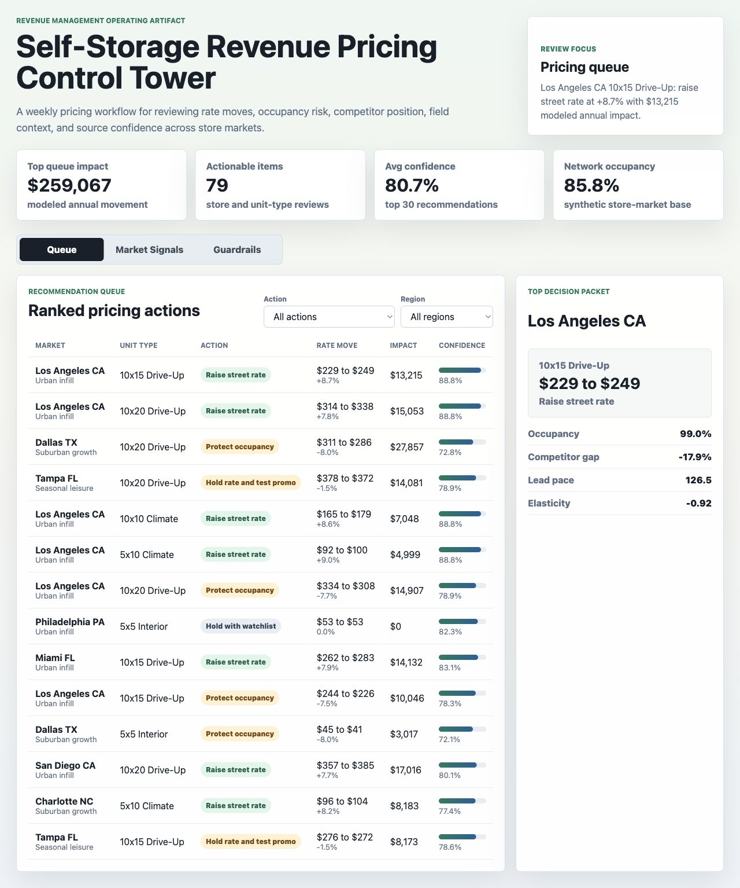
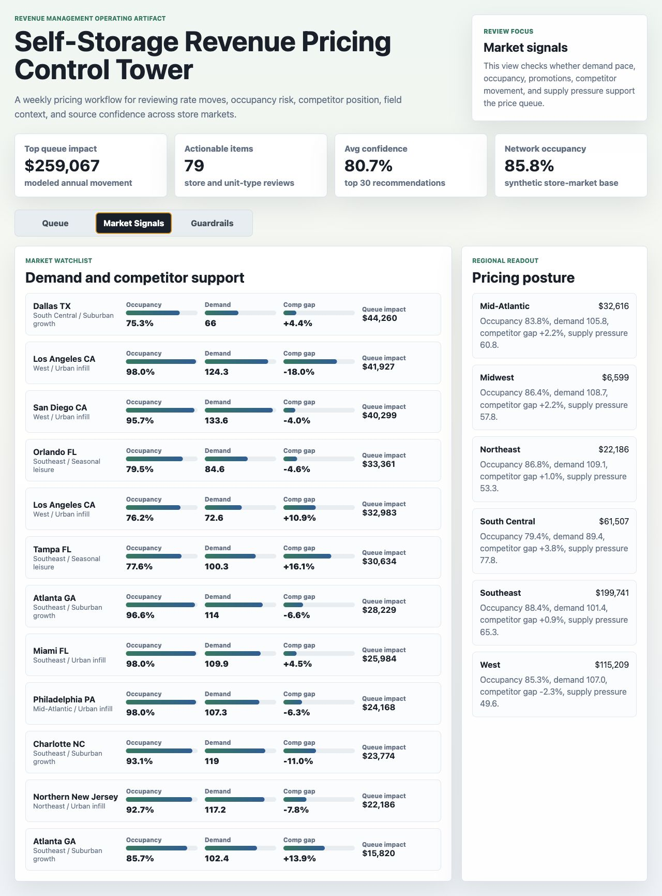
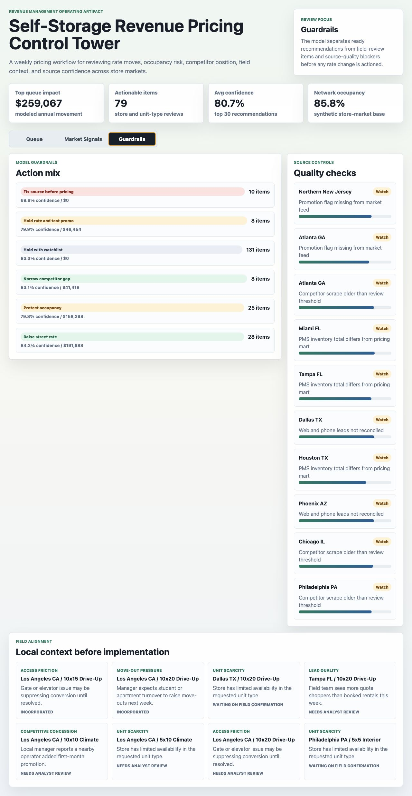

# Self-Storage Revenue Pricing Control Tower

An interactive portfolio artifact for a national self-storage revenue-management team that needs a weekly pricing cadence across many store locations. The control tower connects occupancy, lead pace, competitor price position, seasonal demand, unit-type availability, field feedback, and source-quality checks into one explainable pricing recommendation workflow.

## Screenshots



The pricing queue ranks store-by-unit-type recommendations by expected revenue movement, confidence, occupancy risk, and competitor price gap.



The market signal view shows where occupancy, lead pace, competitor position, promotion depth, and supply pressure support or challenge a rate move.



The guardrail view connects model drivers, data-quality checks, and field feedback so pricing actions are implemented only when the evidence is strong enough.

## What This Project Demonstrates

This project shows how a pricing analyst can move beyond static reporting and operate a defensible revenue-management workflow:

- Identify dynamic pricing actions by store, market, and unit type.
- Balance rate growth against occupancy protection.
- Use competitor pricing and seasonal demand signals to explain recommendations.
- Track source-quality blockers before actioning a price change.
- Incorporate local field feedback into a pricing review cadence.
- Prepare stakeholder-ready reporting that translates analytics into next steps.

## Data

The data is deterministic synthetic data generated by `scripts/score_operating_data.py`. It does not represent real company, customer, facility, competitor, or financial performance. Synthetic data is used because live self-storage pricing is local, dynamic, and commercially sensitive.

The generator creates:

- 42 store-market records with region, market type, rentable square feet, occupancy, demand index, competitor price gap, supply pressure, and data quality.
- 672 weekly market-signal rows with occupancy, leads, move-ins, move-outs, conversion, competitor index, and promotion depth.
- 210 store-by-unit-type pricing recommendations with current rate, competitor median, elasticity, recommended rate, expected annual revenue delta, confidence, and priority score.
- 54 field feedback records that simulate district-manager context.
- 84 source-control checks covering competitor rate freshness, unit inventory reconciliation, promotion mapping, and lead-source completeness.

Rates are synthesized from unit-size baselines, market multipliers, occupancy bands, demand pace, competitor gaps, seasonality, promotion pressure, and elasticity assumptions. Recommendation logic is intentionally explainable: raise when occupancy and demand are strong, protect occupancy when weak demand coincides with vacancy pressure, hold or test promotion when competitor gaps are unfavorable, and block recommendations when source quality is below threshold.

## Analysis Outputs

- `analysis/outputs/priority_queue.csv`: top 30 pricing actions for review.
- `analysis/executive_findings.md`: concise findings and recommendation.
- `analysis/analysis_plan.md`: modeling and workflow plan.
- `analysis/sql_checks.sql`: SQL-style validation checks for blocked recommendations, underpriced high-occupancy units, and market demand summaries.
- `data_dictionary.md`: table grains and field purposes.

## Role Fit

The artifact is designed for a pricing and revenue-management analyst role. It demonstrates the work behind setting and updating prices across a large store network: analyzing store-specific characteristics, monitoring seasonal demand and competitor strategies, creating clear reports, and aligning recommendations with field operations.

## Run Locally

```bash
python3 scripts/score_operating_data.py
python3 -m http.server 49271
```

Then open `http://localhost:49271`.

## Scope

This is a static portfolio artifact with reproducible synthetic data and transparent rules-based scoring. It does not connect to live property-management systems, competitor scrape feeds, pricing engines, finance systems, customer records, or production approval workflows. It does show how a pricing analyst can structure a repeatable operating artifact for dynamic pricing, market monitoring, source validation, and stakeholder-ready action planning.
